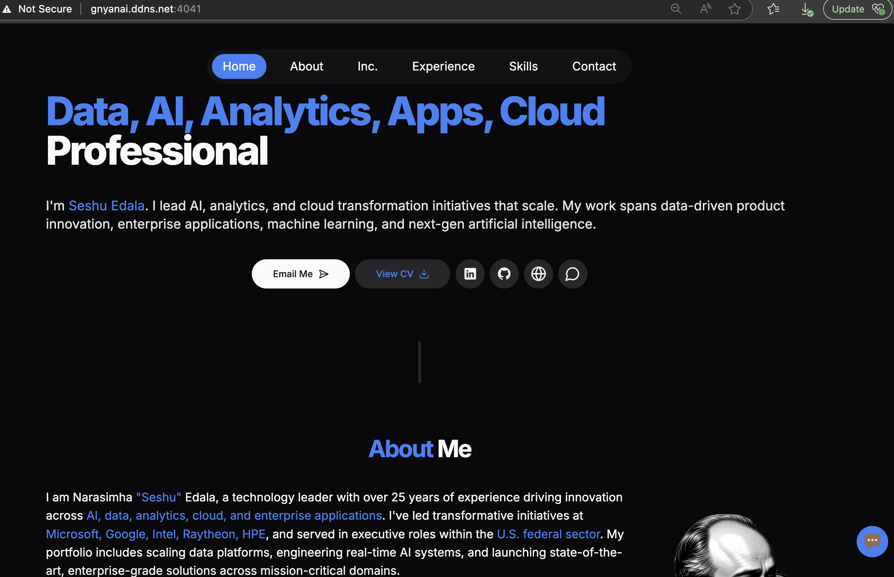

# Seshu's Portfolio Site

Welcome to Seshu Edala's portfolio site! This project showcases Seshu's professional expertise, accomplishments, and technical skills in a visually appealing and interactive layout. The site also integrates advanced chatbot functionalities powered by both ChatGPT and a local LLM.

## Live Preview

You can view the live version of the portfolio site at [http://gnyanai.ddns.net:4041/](http://gnyanai.ddns.net:4041/).



## Features

### 1. **Modern Layout**
- A clean and responsive design built with **Next.js** and **TailwindCSS**.
- Sections include:
  - **Intro**: A brief overview of Seshu's expertise in Data, AI, Analytics, Apps, and Cloud.
  - **Technical Skills**: A comprehensive grid showcasing Seshu's technical proficiencies.
  - **Footer**: Includes credits and an embedded chatbot for user interaction.

### 2. **Comprehensive Skills**
- Highlights Seshu's extensive experience in:
  - AI and Machine Learning
  - Cloud Transformation
  - Data Analytics
  - Enterprise Applications
- Detailed starter prompts in the chatbot provide quick access to Seshu's accomplishments, education, and work history.

### 3. **Chatbot Functionalities**
#### **ChatGPT Integration**
- A button in the **Intro** section links to a ChatGPT-powered chatbot for interactive Q&A about Seshu's portfolio.

#### **Local LLM Integration**
- A locally hosted chatbot powered by **Flowise** and a neural-chat model.
- Features:
  - **Customizable Themes**: Adjust button colors, chat window size, and transparency.
  - **Pre-Primed Questions**: Starter prompts for quick access to frequently asked questions.
  - **Observers**: Logs user input, bot messages, and loading states for debugging or analytics.
  - **Interactive Chat Window**: Supports drag-and-drop, custom icons, and a welcome message.

### 4. **Dockerized Setup**
- The project is fully containerized using **Docker Compose**.
- Services include:
  - **Portfolio Development Server**: Runs the Next.js app in development mode.
  - **Nginx**: Serves the application with SSL support.
  - **Model Loader**: Keeps the local LLM alive by periodically sending requests.

## Getting Started

### Prerequisites
- Docker and Docker Compose installed on your system.

### Installation
1. Clone the repository:
   ```bash
   git clone https://github.com/nedala/portfolio-site.git
   cd portfolio-site
   ```

2. Build and start the services:
   ```bash
   docker-compose up --build
   ```

3. Access the site at [http://localhost:4000](http://localhost:4000).

### Environment Variables
- **Portfolio Development Server**:
  - `SITE_URL`: Base URL of the site.
  - `NODE_ENV`: Set to `development`.
  - `PORT`: Port for the Next.js app.
- **Nginx**:
  - `NGINX_AUTH_USER`: Username for basic authentication.
  - `NGINX_AUTH_PASS`: Password for basic authentication.

## File Structure
```
/app/Portfolio       # Next.js application
/nginx               # Nginx configuration and SSL certificates
/scripts             # Scripts for keeping the local LLM alive
```

## Chatbot Details

### Local LLM (Flowise)
- **API Host**: `http://192.168.27.10:33000`
- **Chatflow ID**: `c074e9eb-4e54-4107-a298-78bb2dc8945e`
- **Starter Prompts**:
  - "Seshu's Email"
  - "Seshu's Contact Details"
  - "Seshu's Work at Microsoft"
  - "What does GNYAN.ai do?"
  - "List of startups founded by Seshu"

### ChatGPT
- A direct link to ChatGPT for additional Q&A:
  - [ChatGPT Link](https://chatgpt.com/g/g-67bf2be913c88191af0b432c2e108533-jobseshu)

## Healthcheck
- The `docker-compose.yml` includes a health check for the local LLM to ensure it is running and responsive.

## Credits
- Portfolio template adapted from [Michał Skolak](https://github.com/Skolaczk).
- Chatbot powered by **Flowise** and **Ollama** with a neural-chat model.

## License
This project is licensed under the MIT License. See the [LICENSE](LICENSE) file for details.